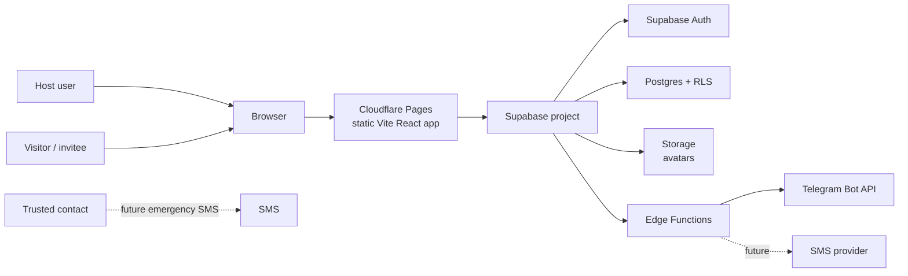
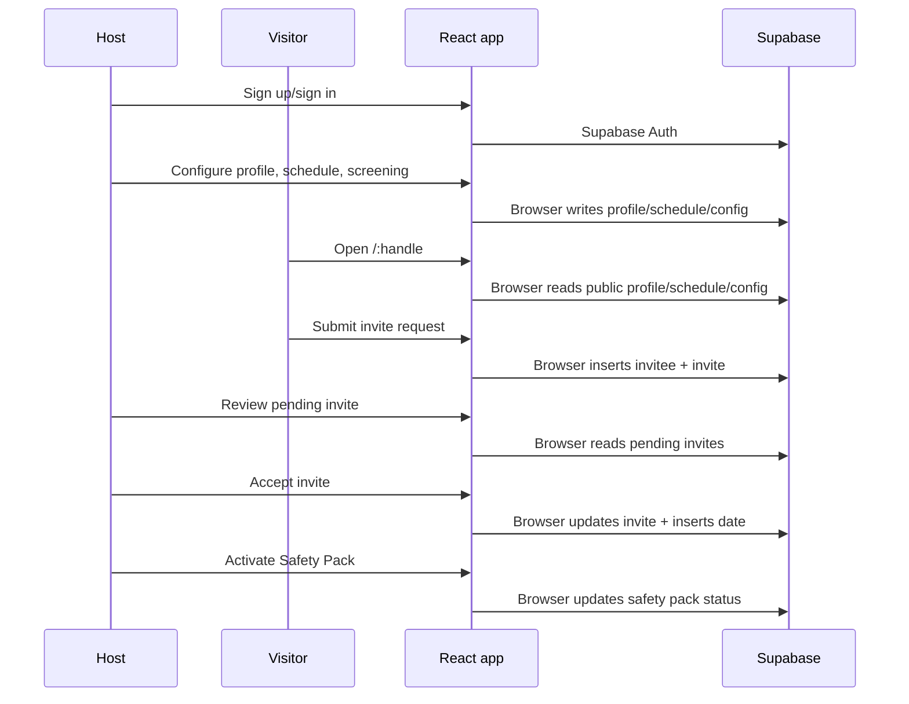
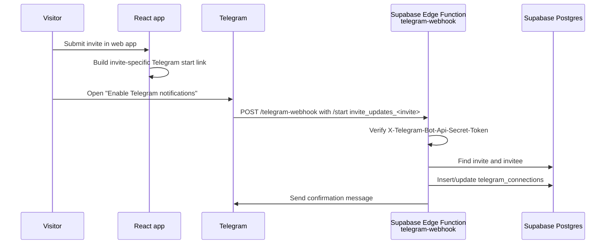
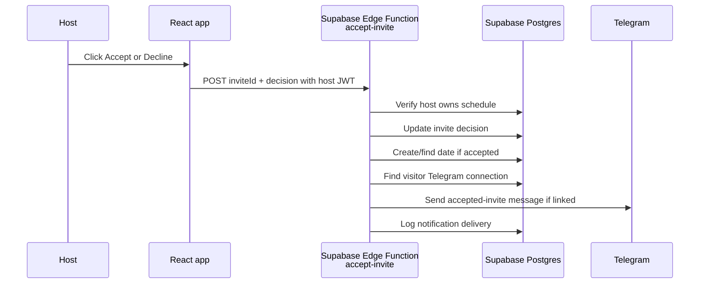
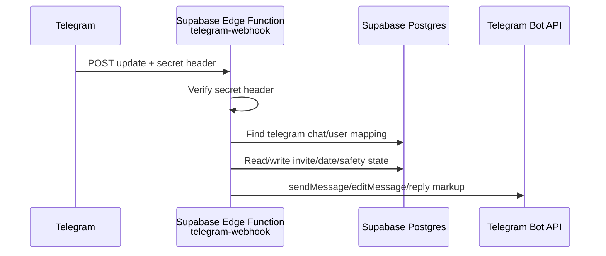

# Architecture

This document describes the current hosted architecture, important security boundaries, and the recommended backend direction. It is linked from the [README](../README.md), [User Journey Scenarios](user-journeys.md), [Agent Notes](../AGENTS.md), [Claude Notes](../CLAUDE.md), and [Production MVP Tasks](../tasks.md).

## System Context

## Runtime Components

| Component | Current role | Notes |
|---|---|---|
| Cloudflare Pages | Hosts the static Vite build from `dist` | Git-connected deploy from GitHub. No custom deploy command. |
| React app | Runs UI, routing, Supabase client calls, and most current product behavior | Public invite submission now uses `submit-invite`; some authenticated host/admin flows still talk directly to Supabase from the browser. |
| Supabase Auth | Host signup/signin and browser session persistence | Current auth is email/password. |
| Supabase Postgres | Profiles, schedules, slots, screening config, invitees, invites, dates, safety packs, catalogs | RLS is the primary security boundary. |
| Supabase Storage | Profile avatar uploads | Uses the `avatars` bucket from the browser. |
| Supabase Edge Functions | `telegram-webhook`, `create-telegram-link`, `submit-invite`, and `accept-invite` are committed for trusted backend workflows | Recommended for trusted server-side workflows. |
| Telegram Bot | Visitor invite-update linking, discovery browsing, accepted-invite notifications, and host invite admin are implemented; safety menus are pending | Uses Telegram webhook secret validation and Supabase Function Secrets. |

## Current Data Flow

This works for the current hosted MVP, but several sensitive transitions should move server-side before public launch. See [tasks.md](../tasks.md).

## Current Telegram Opt-In Flow

This is the first backend-owned Telegram slice. Accepted-invite notification is handled by `accept-invite`.

## Current Acceptance Flow

This improves the current web flow, but full transactional idempotency still needs a Postgres RPC or database-level uniqueness around accepted invite dates.

## Security Boundary

The Supabase publishable key is intentionally visible in the browser. It is not a secret. Security depends on:

- Row Level Security on every table.
- Narrow anonymous policies for public profile and invite submission.
- Authenticated policies for host-owned data.
- Future Edge Functions for trusted operations that need service-role access.

Never expose these in the frontend bundle:

- Supabase secret/service-role keys
- Telegram bot token
- SMS provider keys
- Payment provider keys
- CAPTCHA/Turnstile secret keys

## Backend Direction

Move these workflows out of the browser and into Supabase Edge Functions or Postgres RPCs:

| Workflow | Recommended backend |
|---|---|
| Public invite submission | `submit-invite` Edge Function |
| Invite acceptance | `accept-invite` Edge Function now, transactional RPC later |
| Safety Pack activation | `activate-safety-pack` Edge Function |
| Safety acknowledgements | public `ack-safety-pack` Edge Function |
| Notifications | shared server-side messaging module |
| Telegram bot | `telegram-webhook` Edge Function |

The browser should keep presentation, user interaction, and auth session handling. Trusted validation, idempotency, external API calls, and use of server secrets should live server-side.

## Telegram Bot Feasibility

Yes, a Telegram bot can be implemented inside this Supabase project.

Supabase Edge Functions are TypeScript/Deno HTTP functions intended for webhooks and third-party integrations. Supabase also has an official Telegram Bot Edge Function example using grammY. Telegram's Bot API supports HTTPS webhooks, and `setWebhook` supports a `secret_token` that Telegram sends back in the `X-Telegram-Bot-Api-Secret-Token` header.

Recommended shape:

Implemented:

- `/start invite_updates_<invite>` links a visitor Telegram chat to the invitee for that submitted invite.
- `/start discover_<handle>` starts visitor discovery from the origin profile city, shows one eligible public active discovery-enabled profile at a time, records view/skip/invite events, accepts manual `City: Singapore` context, accepts Telegram native location context, and gates the first Telegram-origin invite link behind mock phone verification.
- `accept-invite` sends the visitor a Telegram message when the host accepts and the visitor linked Telegram.
- `send-phone-otp` and `verify-phone-otp` provide Twilio Verify-backed phone verification primitives for the web invite wizard when `VITE_PHONE_VERIFICATION_MODE=twilio`.

Next bot features:

- `/start` and account linking for hosts.
- Notify host when a new invite arrives.
- Show pending invite summary.
- Accept or decline with inline buttons.
- Send date reminders.
- Safety Pack check-in buttons.
- Visitor accepted-invite notifications after the visitor opts into Telegram.
- Production SMS OTP for Telegram phone verification and richer discovery ranking.

The bot is not required for the first web invite submission. Visitor Telegram linking happens after invite submission or when the visitor chooses to browse nearby profiles.

Important constraints:

- Store `TELEGRAM_BOT_TOKEN` and webhook secret in Supabase Function Secrets.
- Validate `X-Telegram-Bot-Api-Secret-Token` on every webhook request.
- Make handlers idempotent by Telegram `update_id` or callback payload.
- Keep responses quick; queue or log long-running work.
- Treat Telegram chat IDs as sensitive personal data.
- Telegram complements SMS: Telegram is for host/visitor app notifications and check-ins; trusted-contact escalation is SMS-only for now.

## SMS Provider Decision

Use Twilio for the MVP SMS layer.

| Use case | Provider capability | Notes |
|---|---|---|
| Visitor phone verification | Twilio Verify | Used by web invite flow and Telegram discovery invite gate. |
| Safety Pack trusted-contact alert | Twilio Programmable Messaging | Used for manual Emergency and missed-check-in escalation. |

Implementation rules:

- Keep Twilio behind a small server-side SMS provider module so a later Vonage or regional provider fallback is possible.
- Store Twilio credentials only as Supabase Function Secrets: `TWILIO_ACCOUNT_SID`, `TWILIO_AUTH_TOKEN`, `TWILIO_VERIFY_SERVICE_SID`, and `TWILIO_MESSAGING_SERVICE_SID` or sender configuration.
- Never expose Twilio values through Cloudflare frontend variables or any `VITE_` variable.
- Log provider IDs, delivery status, failure reasons, and idempotency keys for OTP and Safety Pack SMS.
- Treat phone numbers as sensitive personal data. Store only the normalized E.164 value and avoid logging full numbers in function logs.

## Planned Notification And Telegram Rules

These rules describe the next implementation phase. See [User Journey Scenarios](user-journeys.md#notification-and-telegram-phase-scenarios).

| Area | Rule |
|---|---|
| Web invite submission | Visitor submits in the web app and must verify phone by SMS before `submit-invite` succeeds. |
| SMS provider | Twilio is the MVP provider: Verify for OTP, Programmable Messaging for Safety Pack alerts. |
| Mock phone verification | Current web wizard defaults to a test code unless `VITE_PHONE_VERIFICATION_MODE=twilio` is set; `submit-invite` re-checks the mock code server-side so the browser cannot simply submit `phone_verified=true`. |
| Telegram opt-in | Visitor is prompted to enable Telegram notifications after successful invite submission. Telegram is optional for the invite itself. |
| Duplicate prevention | Enforce one active pending invite per verified phone per host. |
| Host admin | Linked hosts receive new-invite notifications and can accept/reject in Telegram. |
| Visitor accepted notification | Only visitors who opted into Telegram get accepted-invite notifications through the bot. |
| Host contact sharing | Host chooses accepted-contact method, initially `telegram` or `instagram`. Host phone is not shared by default. |
| Invite page visibility | `public_profile_enabled = false` hides the public profile entirely. |
| Discovery visibility | `discovery_enabled` defaults true. Discovery only includes public, active, discovery-enabled profiles. |
| Safety check-in | Host receives Telegram check-in reminders. Trusted contact receives SMS only for emergency or missed check-in. |
| Discovery location | Start from the first viewed/invited host city, then use Telegram native location or manually sent city if provided. |
| Discovery phone gate | Visitor can browse before phone verification, but the first Telegram-origin invite link is gated by Telegram phone verification. Current verification is mocked with test code `123456`; Twilio-backed verification remains a production task. |

Planned backend surface:

| Function | Purpose |
|---|---|
| `telegram-webhook` | Receive Telegram updates, link accounts, process callback buttons, drive bot menus. |
| `create-telegram-link` | Authenticated host endpoint that creates a short-lived Telegram `/start host_<token>` payload for account linking. Implemented. |
| `send-phone-otp` | Send SMS OTP to visitor phone numbers through Twilio Verify. Implemented. |
| `verify-phone-otp` | Verify Twilio OTP and issue a short-lived phone verification reference. Implemented. |
| `submit-invite` | Validate public invite payload, phone verification, duplicate rule, and create invite server-side. Implemented; CAPTCHA, stronger date validation, one-time link consumption, and screening/moderation enforcement remain planned hardening. |
| `accept-invite` | Transactionally accept invite, create date and Safety Pack draft, enqueue notifications. |
| `decline-invite` | Transactionally decline invite and notify visitor when applicable. |
| `set-profile-visibility` | Let web/bot enable or disable public profile and discovery visibility. |
| `safety-checkin-reminder` | Scheduled reminder and missed-check-in processor. |
| `safety-alert` | Send trusted-contact SMS for emergency or missed check-in through Twilio Messaging. |

Planned data changes:

| Data area | Purpose |
|---|---|
| `telegram_connections` | Current table linking Telegram chat/user IDs to app users or invitees. Future migrations may split this into a stricter `telegram_accounts` model. |
| `telegram_link_tokens` | Stores hashed, short-lived host Telegram linking tokens. Implemented by migration. |
| `discovery_sessions` | Stores Telegram chat discovery context, current profile, pending invite profile, and mock phone verification state. |
| `phone_verifications` | Store OTP challenges, verification status, expiry, and provider metadata. Implemented by migration. |
| `notification_outbox` / `notification_deliveries` | Queue and audit Telegram/SMS notifications. |
| `sms_messages` | Focused delivery table for future Twilio message SID, recipient purpose, delivery status, failure reason, and callback timestamps. Implemented by migration; status callback handling is pending. |
| `trusted_contacts` | Store trusted-contact phone numbers for emergency alerts. |
| `profiles.discovery_enabled` | Control discovery separately from public profile visibility. |
| `profiles.instagram_handle` | Host Instagram contact for accepted-invite sharing. |
| `profiles.accepted_contact_channel` | Host preference for sharing Telegram or Instagram after acceptance. |
| `discovery_events` | Records viewed/skipped/invite-selected profile events plus city/location/phone-gate events for browsing. |

References:

- Supabase Edge Functions overview: <https://supabase.com/docs/guides/functions>
- Supabase Function secrets: <https://supabase.com/docs/guides/functions/secrets>
- Supabase Telegram Bot example: <https://supabase.com/docs/guides/functions/examples/telegram-bot>
- Telegram Bot API webhooks: <https://core.telegram.org/bots/api#setwebhook>

## Related Docs

- [User Journey Scenarios](user-journeys.md)
- [Production MVP Tasks](../tasks.md)
- [README](../README.md)
- [Agent Notes](../AGENTS.md)
- [Claude Notes](../CLAUDE.md)
